# Descripción

- **Nivel:** Fácil.
- **Temas a tratar:** Enumeración, Windows, Active Directory, Kerberoasting.
- **OS:** Windows.
- **Plataforma:** [HackTheBox](https://app.hackthebox.com/machines/627)
- **Fecha de retiro:** 
- **IP victima:** 10.10.11.35
- **IP atacante:** 10.10.14.4
# Enumeración
Empezamos enumerando todos los puertos bajo el protocolo TCP.
```
Nmap scan report for cicada.htb (10.10.11.35)
Host is up, received echo-reply ttl 127 (0.14s latency).
Scanned at 2025-01-17 12:32:38 CST for 104s

PORT      STATE SERVICE       REASON          VERSION
53/tcp    open  domain        syn-ack ttl 127 Simple DNS Plus
88/tcp    open  kerberos-sec  syn-ack ttl 127 Microsoft Windows Kerberos (server time: 2025-01-18 01:32:45Z)
135/tcp   open  msrpc         syn-ack ttl 127 Microsoft Windows RPC
139/tcp   open  netbios-ssn   syn-ack ttl 127 Microsoft Windows netbios-ssn
389/tcp   open  ldap          syn-ack ttl 127 Microsoft Windows Active Directory LDAP (Domain: cicada.htb0., Site: Default-First-Site-Name)
445/tcp   open  microsoft-ds? syn-ack ttl 127
464/tcp   open  kpasswd5?     syn-ack ttl 127
593/tcp   open  ncacn_http    syn-ack ttl 127 Microsoft Windows RPC over HTTP 1.0
636/tcp   open  ssl/ldap      syn-ack ttl 127 Microsoft Windows Active Directory LDAP (Domain: cicada.htb0., Site: Default-First-Site-Name)
...
```
Analizando los puertos nos encontramos con un AD, que cuenta con LDAP.
Como no contamos con algún servicio web nos dirigimos primeramente a enumerar los servicios *SMB* y *LDAP* utilizando la wiki de *NetExec* [Enumerate Null Sessions SMB](https://www.netexec.wiki/smb-protocol/enumeration/enumerate-null-sessions) y [Enumerate Users LDAP](https://www.netexec.wiki/ldap-protocol/enumerate-users).
# Descubrimiento de Usuarios
## Archivos Compartidos
Con *smbclient* enumeramos los archivos que son comparticos en el sistema con el paramento *-NL* para enumerar carpetas sin el uso de credenciales.
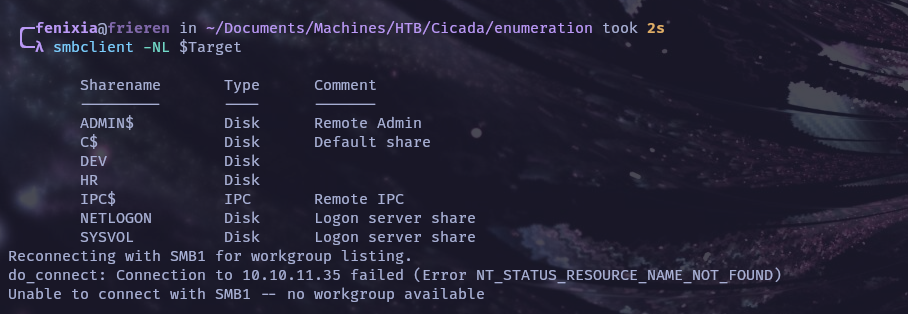
Existen 2 carpetas interesantes, primero enumeremos*DEV*:
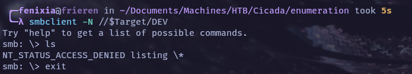
Ahora con *HR*:
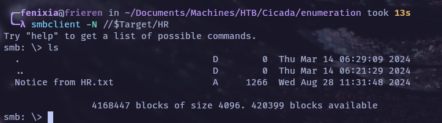
Muy bien, tenemos un archivo que posiblemente sea del departamento de Human Resources (Traducción: Recursos Humanos).Traigamos el archivo y veamos su contenido:
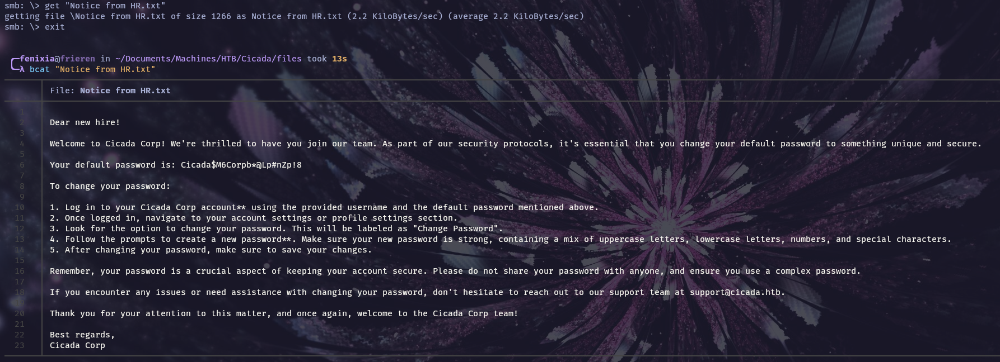
Indica que existe una clave por defecto dentro para todos los usuarios nuevos: Cicada$M6Corpb*@Lp#nZp!8. Con esto, solamente falta tener una lista de usuarios. Podemos intentar directamente lanzarnos por un ataque de fuerza bruta con una lista de usuarios disponibles dentro de SecList, pero intentemos ver si podemos obtener usuarios como lo visto en la máquina [Forest](https://fen1x1a.github.io/posts/forest/) 
## Enumeración Null Session
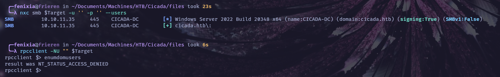
Con null session no permite realizar enumeracion, así que intentemos enumerar usuarios como *guest*.
## Enumeración Usuarios por Fuerza Bruta con RID
*NetExec* cuenta con la herramienta de fuerza bruta con *RID*  (Recomiendo leer el siguiente articulo sobre esto [Difference between a RID and SID](https://morgantechspace.com/2013/10/difference-between-rid-and-sid-in.html)).
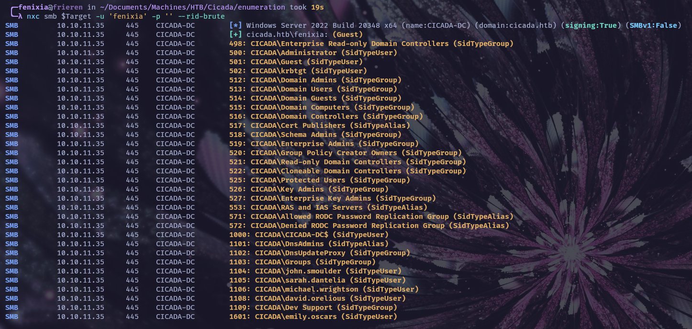
En este caso tenemos un output bastante amplio, para un entorno mas real tendremos una lista enorme de usuarios así que para esto recomiendo agregar lo siguiente para tener una lista filtrada de usuarios:
```bash
| grep "SidTypeUser" | awk -F'\\' '{print $2}' | awk '{print $1}'
```
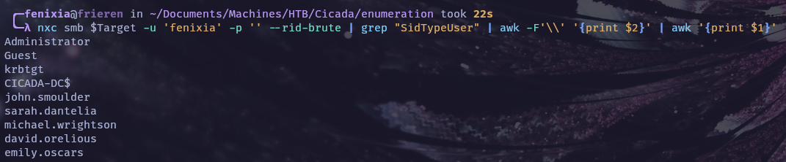
# Compromiso Inicial
Ya que tenemos una clave por defecto y la lista de usuarios ejecutamos un *Password Spray Atack* hacia la diferentes cuentas:
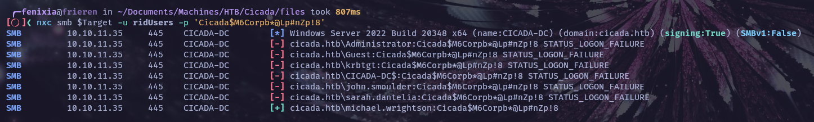
## Movimiento Lateral
Con el usuario comprometido, intentemos una ejecución remota de comandos:
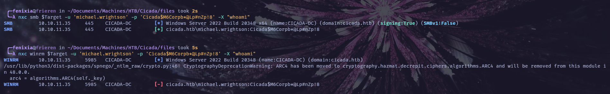
Esto significa que el usuario no tiene permisos de ejecución de comandos. Sigamos enumerando a ver que encontramos:
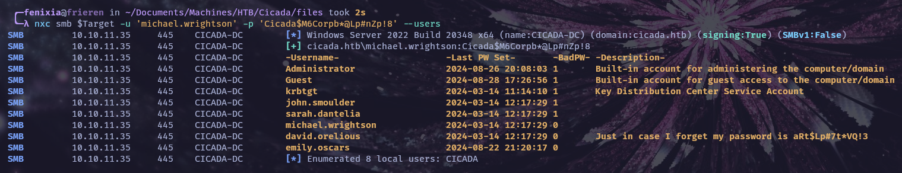
En la descripción tenemos credenciales del usuario *david.orelious*, si intentamos ejecución de comandos esto no funcionara, en este punto pareciera que estamos en un*rabbit hole*, pero no, si volvemos al momento que estábamos enumerando las carpetas compartidas encontramos la carpeta */DEV*, este usuario tiene permisos de lectura:
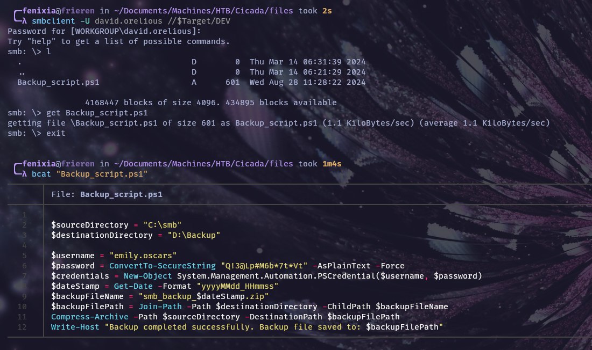
## Acceso al sistema
Ahora volvamos a intentar si este usuario tiene permisos de acceso por *WinRM*:
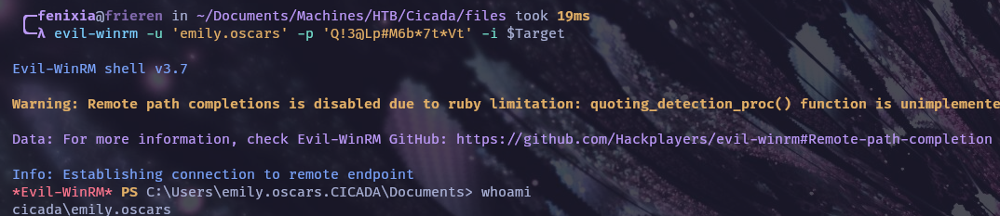
# Escalada de privilegios
Como es un entorno de AD podemos ayudarnos de alguna herramienta como *PowerView* o *BloodHound*, pero en esta maquina se puede visualizar los permisos de usuario con herramientas del sistema operativo:
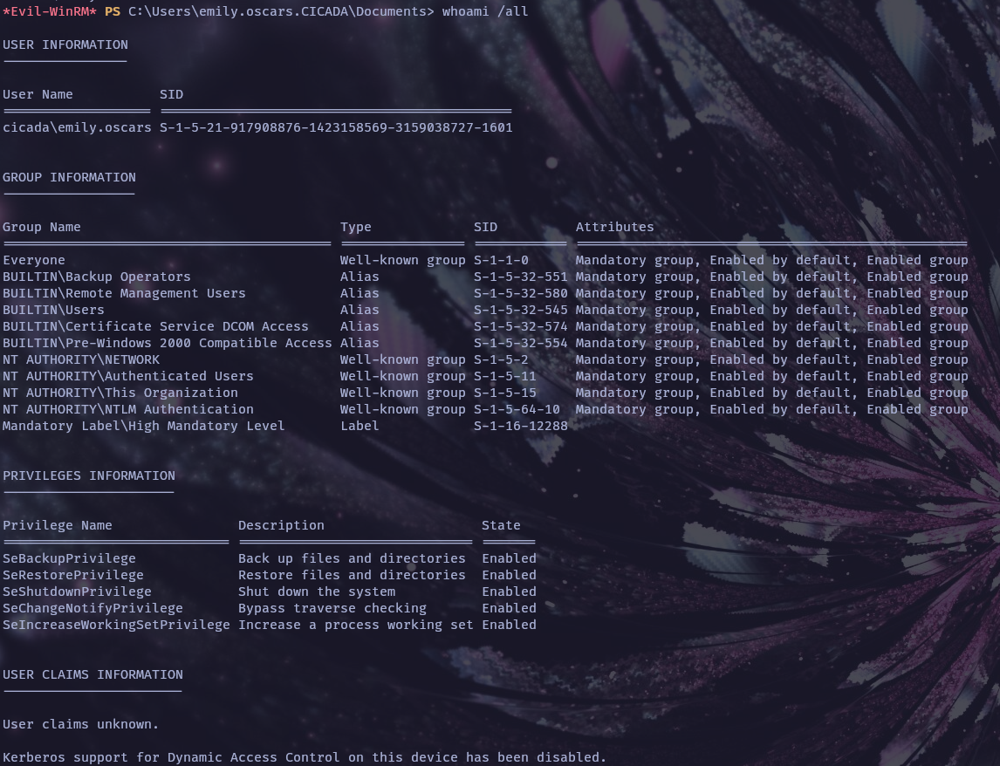

> [!NOTE]
> En mi caso quería probar como se vería utilizando BloodHound, pero este paso no es necesario, solo si quieren experimentar con BloodHound. 

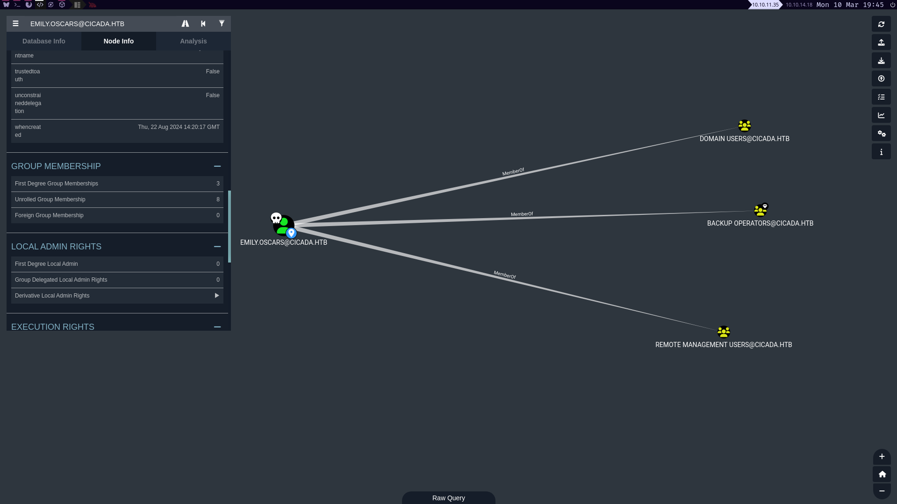
Como podemos observar estamos dentro del grupo *Backup Operators*, los miembros de este grupo pueden realizar copias de seguridad y restaurar todos los archivos del ordenador, independientemente de los permisos que protejan esos archivos; con esto dicho podemos realizar una copia de la *SAM* del sistema y realizar un *Pass The Hash*.
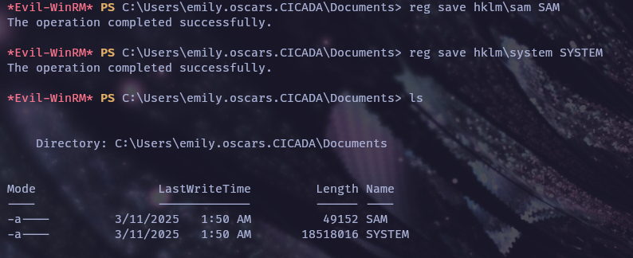
Ya con esto podemos enviarnos estos archivos y extraer los hashes.
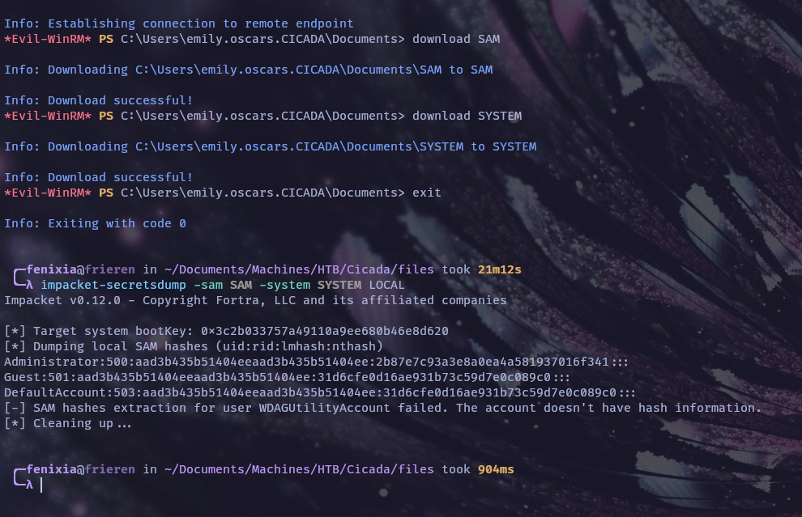
> [!NOTE]
> Si esto se ejecutara en un entorno real el EDR nos bloquearía la ejecución del comando reg.

Y ahora podemos realizar un *Pass The Hash* via *evil-winrm*:
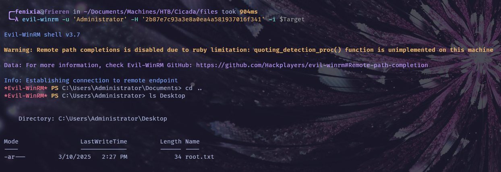

___
### Happy Hacking!
